Hi-Res Slices
=============

To illustrate how prettypretty fares with arbitrary colors being downsampled to
8-bit terminal colors, here are three slices through the RGB cube along two axes
each while holding the third axis fixed at either 0 or 255. For each such
configuration, there are two screenshots, one to show off the grid of true color
and one to illustrate the reduction to 8-bit.

That conversion, by the way, doesn't include the extended ANSI colors. I
included them originally. But when generating color grids like these, I noticed
that the extended ANSI colors are rather distinct from the 6x6x6 RGB cube and
24-step gray gradient and hence are best avoided when mapping down to 8-bit
colors. In fact, one major benefit of grids featuring fine-grained,
two-dimensional color transitions is that outliers stick out even more when
everything else is presented for minimal differences.

A Slice Through GB, With R=0
----------------------------

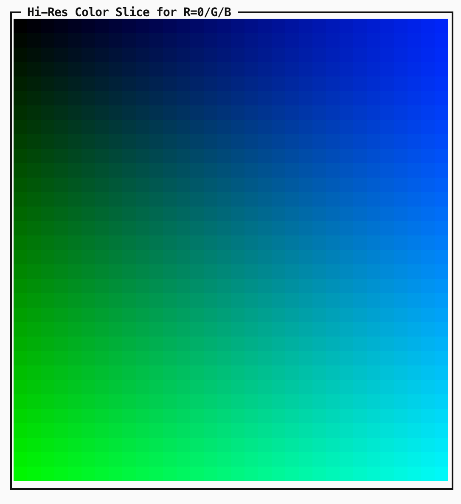

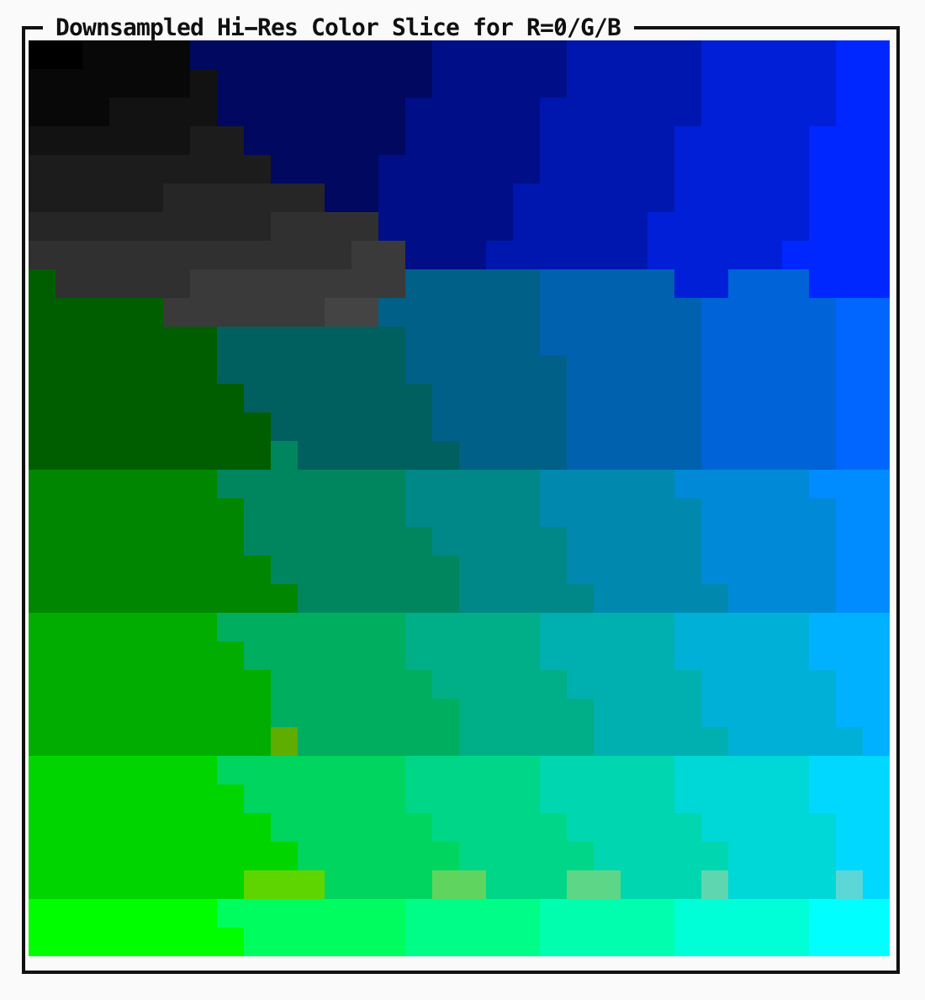

A Slice Through GB, With R=255
------------------------------

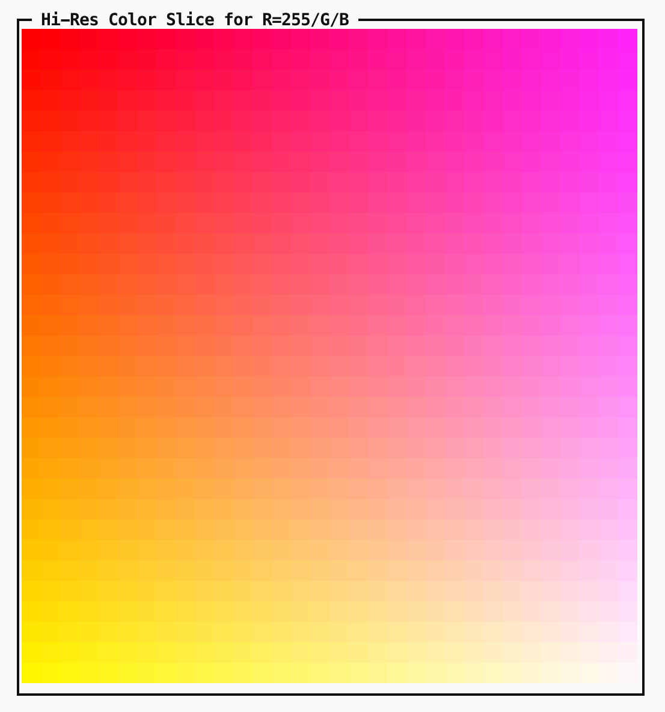

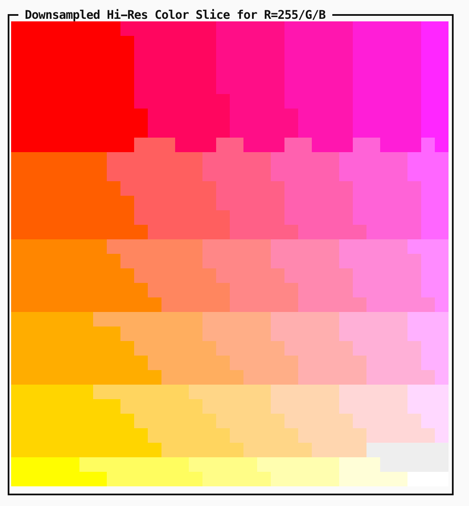

A Slice Through RB, With G=0
----------------------------

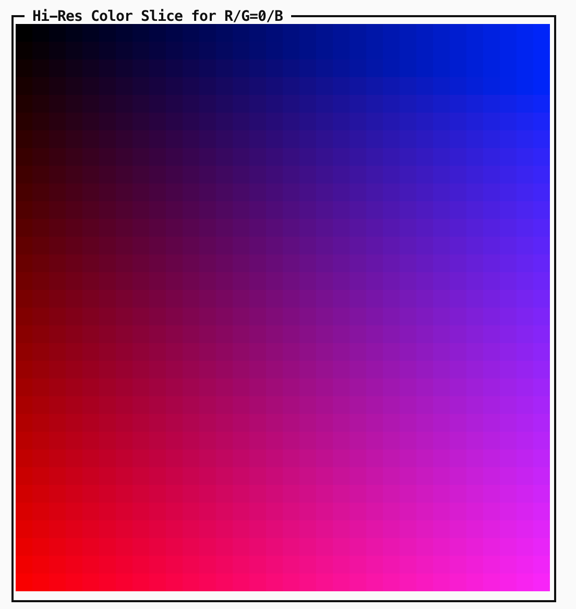

.. image:: figures/slice-g00-reduced.png
   :alt: with

A Slice Through RB, With G=255
------------------------------

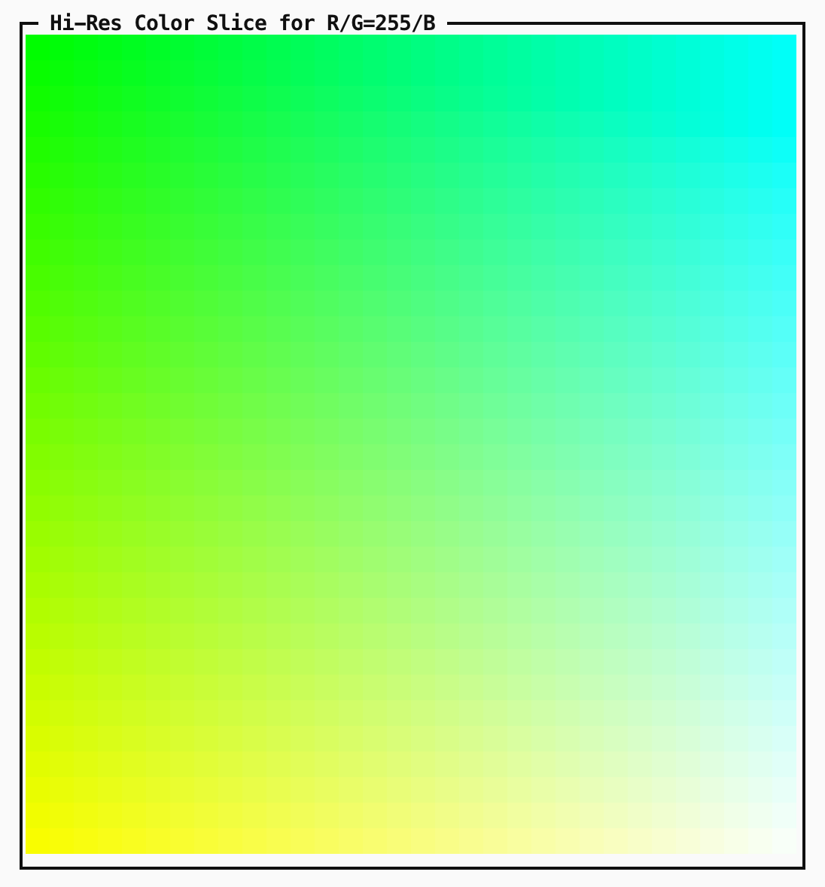

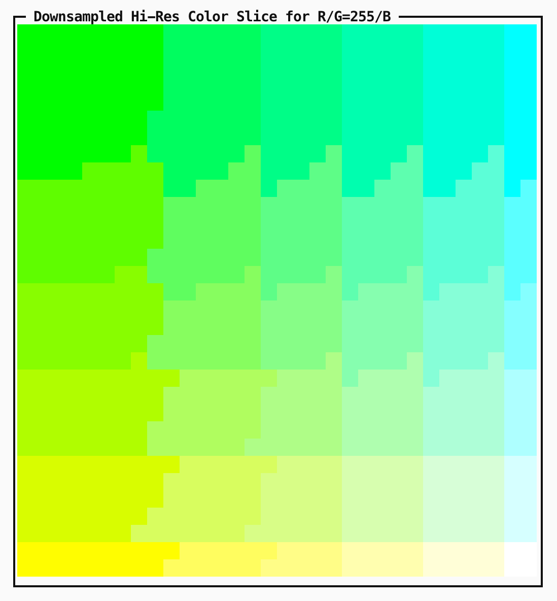

A Slice Through RG, With B=0
----------------------------

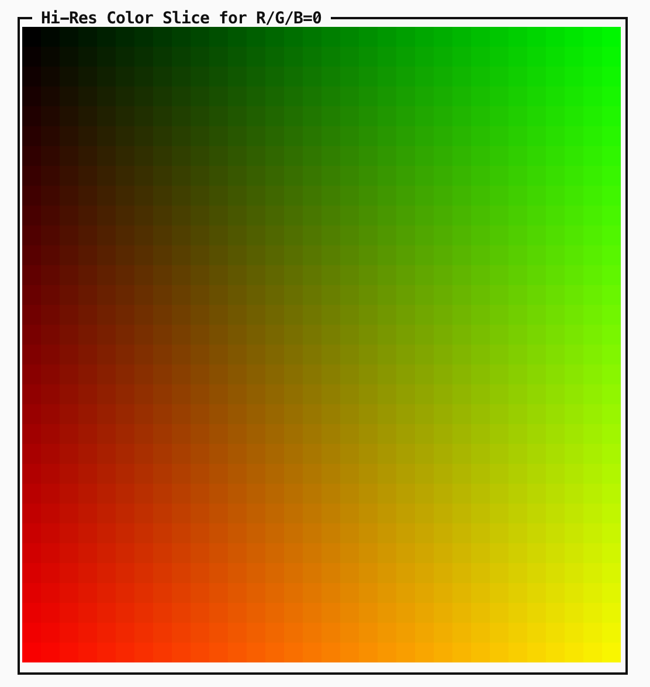

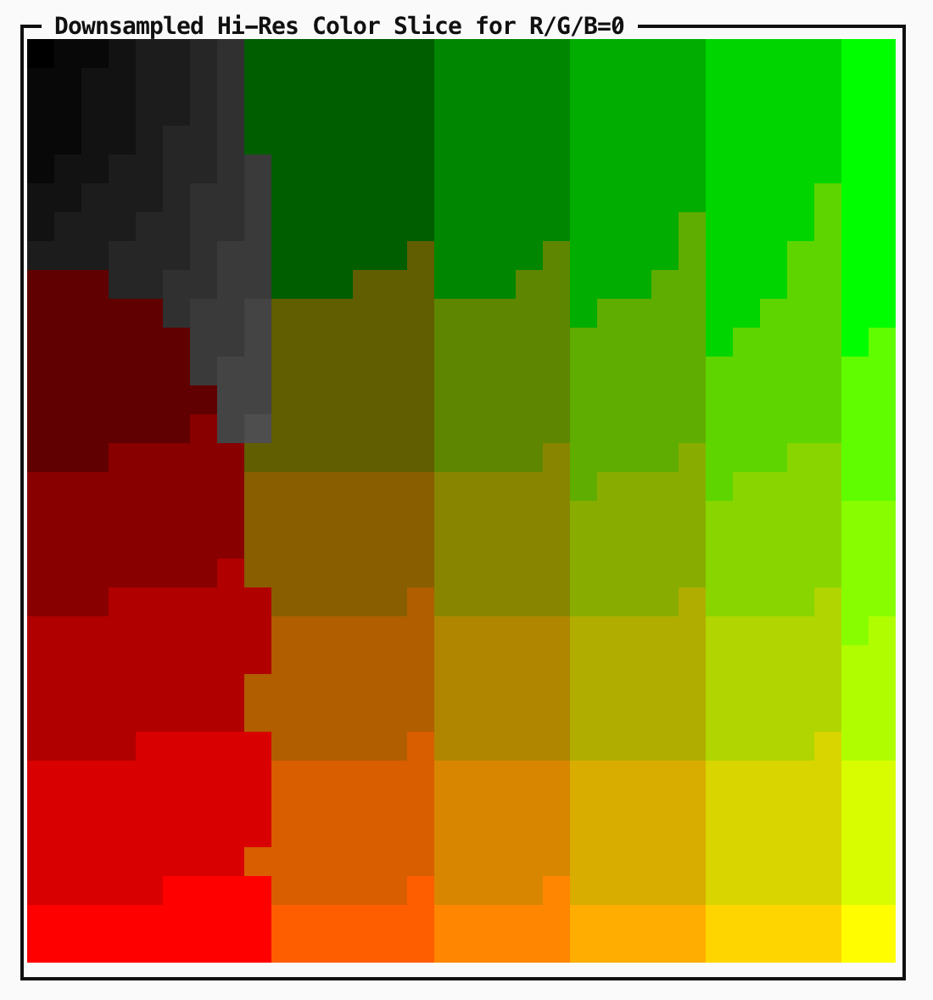

A Slice Through RG, With B=255
------------------------------

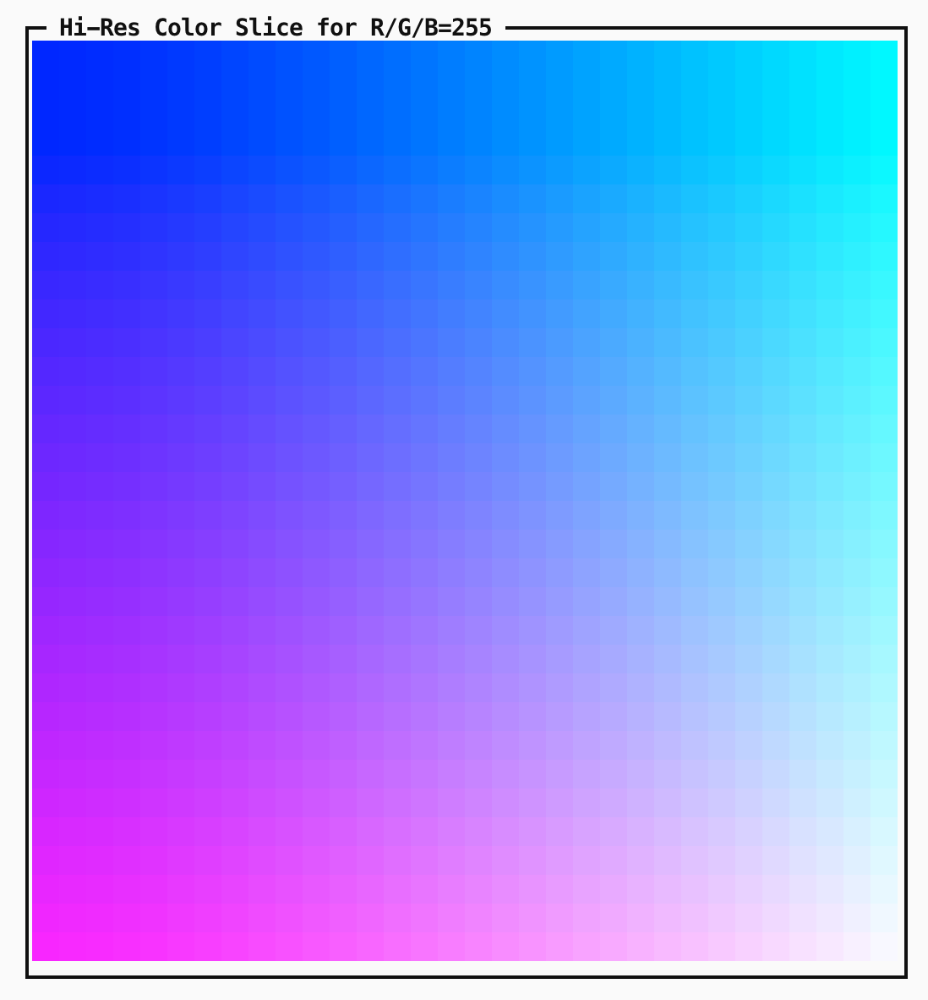

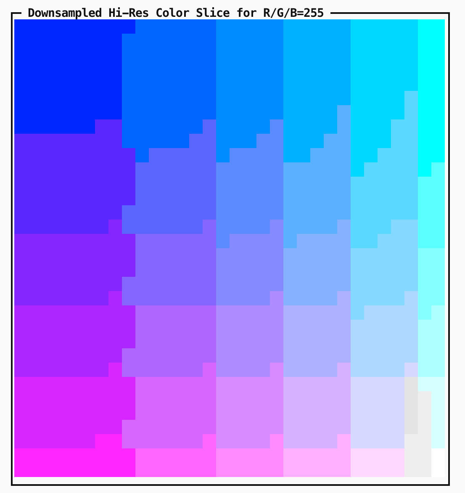

