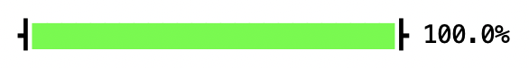
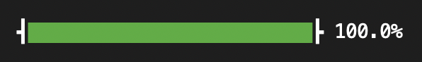

How to Pretty-Pretty
====================

Let's see what prettypretty can do for your command line tools. I picked the
implementation of a progress bar for several reasons. First, I've been itching
to write one myself for quite a while now. Second, animated anything is nice and
shiny, i.e., makes for a good demo. Third, the script is simple enough to
comfortably fit into less than 100 lines of Python, yet complex enough to show
off most major features. The `complete script
<https://github.com/apparebit/prettypretty/blob/main/prettypretty/progress.py>`_
is part of prettypretty's distribution.

The Progress Bar in Action
--------------------------

So, a good start for you is to create a new virtual environment, install
prettypretty into it, and run the progress bar demo:

.. code-block:: console

   $ mkdir progress
   $ cd progress
   $ python -m venv .venv
   $ source .venv/bin/activate
   $ python -m pip install prettypretty
   Downloading prettypretty-0.3.0-py3-none-any.whl (64 kB)
   Installing collected packages: prettypretty
   Successfully installed prettypretty-0.3.0
   $ python -m prettypretty.progress

(The above command line incantations work just as written on Linux and macOS.
But you may have to adjust them somewhat, if you use a package manager other
than pip or are running Windows. I trust you know what to do differently.)

That last command actually executes our demo script. You should see a progress
bar rapidly going from 0% to 100%. It ends up looking like this:

Or, if your terminal's color theme is a dark theme, it may end up looking like
this:

Display P3, sRGB, 8-bit Color, Oh My
------------------------------------

If you compare the two screenshots, you may notice that the progress bars have
different shades of green, with the dark mode version less bright and containing
some blue. That difference is very much intentional. To show off prettypretty's
color conversions, I picked an aggressively green green for the light mode, the
primary green for the `Display P3 <https://en.wikipedia.org/wiki/DCI-P3>`_ color
space, i.e., the color with tag ``p3`` and coordinates ``0, 1, 0`` when using
prettypretty. Since bright colors seem even brighter against a dark background,
that green most certainly won't do for dark mode and I picked a second, darker
green as well, i.e., the color with tag ``rgb256`` and coordinates ``3, 151,
49``, which is three divisions by 255 away from the color with tag ``srgb`` and
coordinates ``0.01176, 0.59216, 0.19216`` (rounded to five decimals).

As the examples suggest, prettypretty's color representation includes a tag—to
identify the color format or space—and the coordinates. Supported formats,
including ``ansi``, ``eight_bit``, ``rgb6``, and ``rgb256``, have one or three
integer coordinates, whereas supported color spaces, including ``srgb``, ``p3``,
``oklab``, and ``oklch``, have three floating point coordinates. For the RGB
color spaces, including ``srgb`` and ``p3``, the coordinates are normalized,
i.e., range from 0 to 1, inclusive. Prettypretty can convert between all of
these formats and color spaces, though some of the conversions are inherently
lossy.

Prettypretty's basic color abstraction, :class:`.ColorSpec`, is just a record
with a ``tag`` and ``coordinates``. Prettypretty also has a fully featured color
class, :class:`.Color`, that adds a good number of methods to the basic color
specification record. To actually write out colors, you have a number of
options:

 1. Invoke :class:`.ColorSpec` on a tag and coordinates tuple;
 2. Use the :meth:`.ColorSpec.of` helper method, which gets rid of extra
    parentheses by accepting coordinates inline, as arguments;
 3. Treat prettypretty's main methods expecting colors, :meth:`.StyleSpec.fg`,
    :meth:`.StyleSpec.bg`, :meth:`.Terminal.fg`, and :meth:`.Terminal.bg`, as if
    they were :meth:`.ColorSpec.of`;
 4. Invoke :class:`.Color` on a string literal with the color in hexadecimal, X
    Windows, or functional notation.

The code below illustrates all four options on the example of setting a
terminal's foreground color to the primary greens of 8-bit and 24-bit colors,
which really are one and the same color.

.. code-block:: python

   from prettypretty.color.spec import ColorSpec
   from prettypretty.color.object import Color
   from prettypretty.terminal import Terminal

   # Create terminal, don't let any styles leak
   with Terminal().scoped_style() as term:

      # 8-bit color 46 is primary green of embedded 6x6x6 RGB cube
      term.fg(ColorSpec('eight_bit', (46,)))
      term.fg(ColorSpec.of(46))
      term.fg(ColorSpec.of('eight_bit', 46))
      term.fg(46)
      term.fg('rgb6', 0, 5, 0)

      # '#00FF00' is the primary green of sRGB
      term.fg('srgb', 0, 1, 0)
      term.fg('rgb256', 0, 255, 0)
      term.fg(Color('#00ff00'))
      term.fg(Color('rgb:0000/ffff/0000'))
      term.fg(Color('srgb(0, 1, 0)'))

It appears that Kermit was wrong. It's pretty easy being green after all.

What isn't so easy is locking down the exact shade of green being displayed. In
fact, that's pretty much out of our hands. If you have done any web development,
then this should be familiar: You can express an aspirational goal for the
appearance of your web pages, but the actual rendered result very much depends
on the current device, web browser, and network connectivity. It works pretty
much the same way when it comes to color and terminals—except terminals don't do
graceful degradation, let alone progressive enhancement. Prettypretty does that
for you!

Against that background, it won't come as too much of a surprise when I tell you
that the above screenshots do *not* show the primary green of Display P3 nor the
color we now know to write as

.. code-block:: python

   ColorSpec('rgb256', (3, 151, 49))
   ColorSpec.of('rgb256', 0x03, 0x97, 0x31)
   Color('#039731')

Instead, the first screenshot shows the primary green of sRGB and the second
screenshot shows the color we now know to write as

.. code-block:: python

   ColorSpec.of(28)
   ColorSpec.of('rgb6', 0, 2, 0)
   ColorSpec.of('rgb256', 0, 135, 0)
   Color('#008700')

How did we get there? Conceptually, it's pretty straight-forward. Upon
initialization of its :class:`.Terminal` abstraction, prettypretty makes an
educated guess about the terminal's color capabilities and, from then on out, it
automatically checks every color before using it. If a color *cannot* be
displayed on the current terminal, prettypretty first converts it to the next
best matching color that *can* be displayed.

Making Color Renderable: The Technical Details
~~~~~~~~~~~~~~~~~~~~~~~~~~~~~~~~~~~~~~~~~~~~~~

In practice, it's quite a bit more involved. To begin with, terminals support
either ANSI colors, 8-bit colors, or truecolor, which is the same as 24-bit RGB,
tagged ``rgb256`` in prettypretty. Next, prettypretty uses different techniques
for converting colors from arbitrary color spaces such as Display P3 to
sRGB/RGB256 and for converting sRGB colors to 8-bit or ANSI colors. Of course,
if it needs to convert colors from an arbitrary color space to 8-bit or ANSI
colors, it successively employs both techniques.

**To convert to sRGB**, prettypretty first performs the actual conversion
between color spaces and then checks whether the result is in gamut, i.e.,
whether the color is part of the sRGB color space. For example, the green
primary for Display P3 converts to the coordinates -0.5116, 1.01827, -0.31067 in
sRGB (rounded to 5 decimals). Since RGB color space coordinates need to fit into
the normal range between 0 and 1, these coordinates are pretty glaringly out of
gamut.

If the coordinates are out of gamut, as in the example, prettypretty uses the
`gamut mapping algorithm <https://www.w3.org/TR/css-color-4/#gamut-mapping>`_
from CSS Color 4 to find the next best color in sRGB. In the example, that color
has the sRGB coordinates 0, 0.98, 0.16 (again, rounded to 5 decimals). In other
words, Display P3's green primary doesn't even map to sRGB's green primary. The
reason I claimed that the color in the first screenshot is sRGB's green primary
is the next conversion.

**To convert to ANSI or 8-bit color**, prettypretty exhaustively compares the
color to be converted against all of the 16 extended ANSI colors or 240 of the
256 8-bit colors and picks the one that is closest. Doing so requires a shared
color space and ideally one with a meaningful distance metric. Prettypretty uses
the perceptually uniform Oklab color space and its ΔE metric, which is just the
Euclidian distance between coordinates.

However, to compare colors in Oklab, prettypretty must first convert them to
Oklab. But the ANSI colors have no standard definitions and most terminals
modify them with color themes anyways. Prettypretty works around that by using
ANSI escape codes to query the terminal for all colors in its current theme and
then uses those color values when converting colors to ANSI by searching for the
closest match in Oklab.
