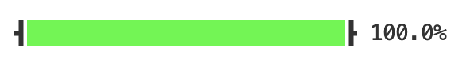

How to Prettypretty
===================

Let's use prettypretty to build something simple enough to fit into less than
100 lines of Python code but complex enough to show off major features. Since
shiny and sparkly usually makes for a better show, let's build a simple progress
bar that grows from 0% to 100% in less than two seconds. The `complete script
<https://github.com/apparebit/prettypretty/blob/main/examples/progress.py>`_ is
part of prettypretty's repository. When you run it, the script displays a
progress bar that quickly fills in bright green and ends up looking like this:

