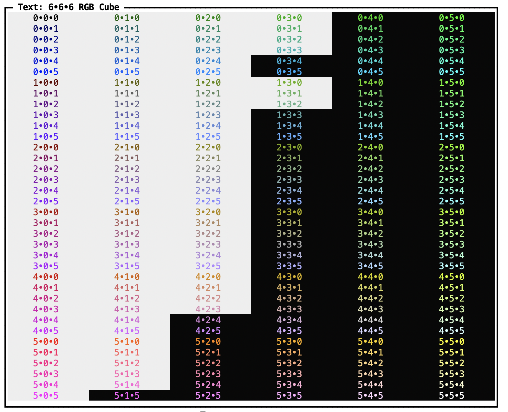
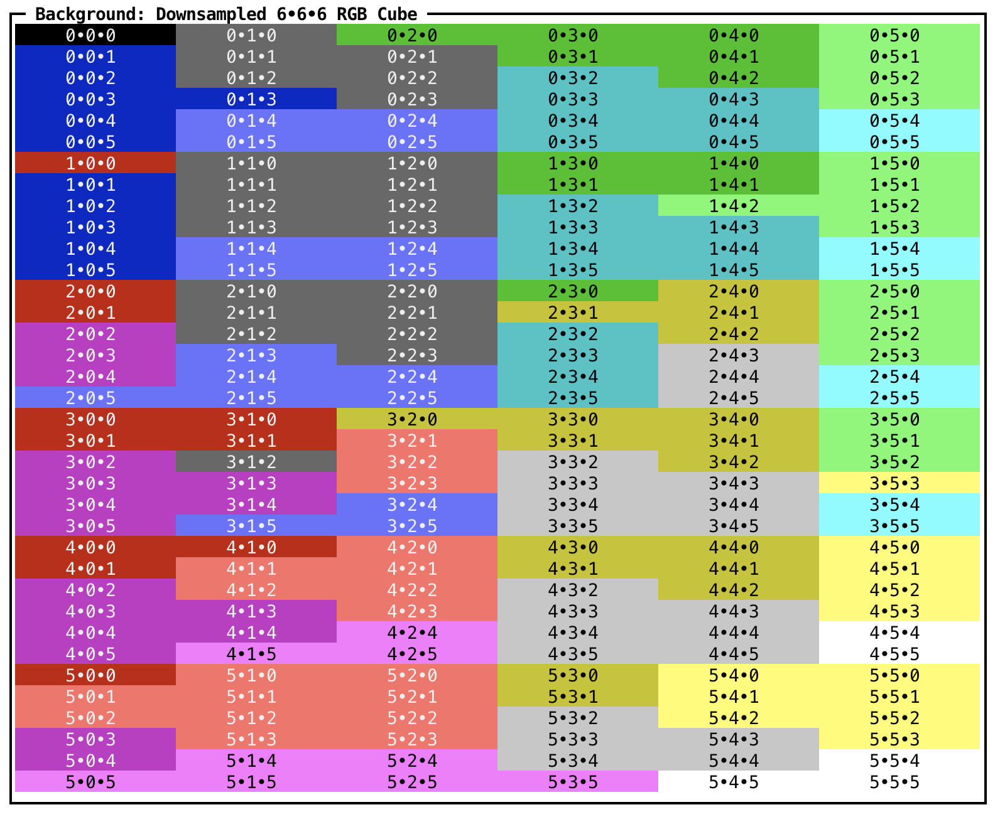

prettypretty
============

Prettypretty helps build terminal user interfaces in Python. Notably, it
provides expressive color management, including operating in perceptually
uniform color spaces.

.. toctree::
   :maxdepth: 1
   :hidden:

   self

.. toctree::
   :maxdepth: 1
   :caption: Guides

   formats-and-spaces
   conversions
   tools

.. toctree::
   :maxdepth: 1
   :caption: API

   apidocs/prettypretty
   apidocs/color

.. toctree::
   :maxdepth: 1
   :caption: Links
   :hidden:

   Repository <https://github.com/apparebit/prettypretty>

Prettypretty Illustrated
------------------------

The first screenshot illustrates prettypretty's support for maximizing text
contrast by comparing against backgrounds in all 216 colors from the 6x6x6 RGB
cube of 8-bit terminal colors.

.. image:: figures/rgb6-background.png
   :alt: The 6x6x6 RGB cube used for background colors

The second screenshot illustrates the reverse challenge, with prettypretty
picking the background color to maximize contrast for text in all 216 colors
from the 6x6x6 RGB cube. If you compare with the previous screenshot, you may
notice that prettypretty's contrast metric, `APCA
<https://github.com/Myndex/apca-w3>`_, is *not* symmetric. That's just why it is
more accurate than, say, the WCAG 2.0 formula.

The third screenshot illustrates prettypretty's support for finding the
perceptually closest color out of several colors. That's just how prettypretty
performs high-quality downsampling, in this case turning the 216 colors from the
6x6x6 RGB cube into 16 extended ANSI colors.

.. image:: figures/rgb6-ansi-macos.png
   :alt: The 6x6x6 RGB cube used for text colors

Since almost all terminals have robust support for theming just those 16
extended ANSI colors, prettypretty doesn't just use some hardcoded set of colors
but has built-in support for color themes. You can of course configure and
reconfigure the current colors as you please. But prettypretty can do one
better: It can automatically query a terminal for the current theme colors.
The fourth screenshot illustrates the impact. When running in iTerm2 instead of
macOS Terminal, prettypretty makes good use of the brighter colors in one of
iTerm's builtin themes and generates a substantially different grid!

To recap, prettypretty has robust support for:

  * Maximizing the label contrast for a given background color;
  * Maximizing the background contrast for a given text color;
  * Finding the closest color out of several;
  * Using that search to perform high-quality downsampling;
  * Theming the sixteen extended ANSI colors;
  * Automatically determining the current terminal theme.

More is yet to come...

Acknowledgements
----------------

Implementing this package's color support was a breeze. In part, that was
because I had built a prototype before and knew what I was going for. In part,
that was because I copied many of the nitty-gritty color algorithms and
conversion matrices from the most excellent `Color.js <https://colorjs.io>`_
library by `Lea Verou <http://lea.verou.me/>`_ and `Chris Lilley
<https://svgees.us/>`_. Theirs being a JavaScript library and mine being a
Python package, there are many differences, small and not so small. But without
Color.js, I could not have implemented color support in less than a week. Thank
you!
