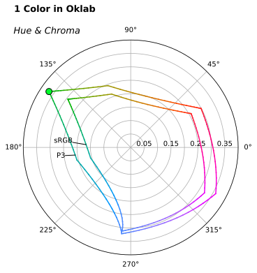

# The Appearance of Progress

To explore how command line tools can benefit from prettypretty's approach to
terminal styling, this deep dive explores how to display a progress bar. I
picked this topic for a few reasons:

 1. I've been itching to write a progress bar for quite a while now.
 2. An animated demo often is more interesting than a static one.
 3. The script is simple enough to fit into less than 100 lines of Python.
 4. The script provides a feature that's actually useful to terminal apps.

The complete script is, of course, part of [prettypretty's
repository](https://github.com/apparebit/prettypretty/blob/main/prettypretty/progress.py)
and also included in its distribution.


## Visualizing Progress

To get started, you probably want to run the progress bar script yourself. So
please create a new virtual environment, install prettypretty into it, and run
the progress bar script:

```sh
$ mkdir progress
$ cd progress
$ python -m venv .venv
$ source .venv/bin/activate
$ python -m pip install prettypretty
Downloading prettypretty-0.11.0-cp311-abi3-macosx_10_12_x86_64.whl (420 kB)
Installing collected packages: prettypretty
Successfully installed prettypretty-0.11.0
$ python -m prettypretty.progress
```

Please note that prettypretty requires Python 3.11 or later. Pre-built binary
wheels are available for Linux, macOS, and Windows. Building prettypretty from
source requires a number of tools in addition to the Rust compiler and Python
interpreter. The [runner
script](https://github.com/apparebit/prettypretty/blob/main/rr.sh) in the
repository root has an `install` option to automatically install them on a
system.

The last command amongst the shell incantations above actually executes the
progress bar script. You should see a green bar rapidly go from 0% to 100%. If
your terminal uses a light theme, it probably ends up looking like this:


If your terminal uses a dark theme, it probably ends up looking more like this:


Notice that the two progress bars use different tones of green. In particular,
the green tone for the dark theme is considerably less bright and vivid. That is
by design. Human vision adapts to lighting conditions and we tend to perceive
the same colors more intensely when they are presented in a darker context.


## Design Thinking for Terminal Tools

In addition to colors, terminals support a few more attributes for styling text,
including bold, italic, and underlined. Of course, we could just write the
corresponding ANSI escape sequences to the terminal. Mind you, we'd still rely
on a nicely encapsulated terminal logger with clearly distinguishable styles for
status updates versus error messages. But considerable experience with styling
the web serves as stark reminder that presentational aspects better be separated
from content. In fact, maintaining that separation in a principled manner
typically results in more consistent user interfaces that may just offer a
better user experience. It also helps with engineering, e.g., by discouraging
code duplication.

Achieving something similar for terminal applications is entirely within our
reach. That doesn't mean we should slavishly follow design methodologies for the
web and repurpose its technologies. Far from it. For instance, where the web
encourages progressive enhancement from basic sRGB colors to colors in more
expressive as well as wide-gamut color spaces, prettypretty goes the opposite
direction and offers automatic graceful degradation. Here then is prettypretty's
one-two-three for better terminal styles.


## 1. Assemble Styles

If we are to isolate terminal styles from content, we should start by grouping
the definitions for all application styles together. For the progress bar
script, that's a grand total of two styles:

```python,ignore
LIGHT_MODE_BAR = stylist().foreground(Color.p3(0.0, 1.0, 0.0)).et_voila()
DARK_MODE_BAR = stylist().foreground(TrueColor(3, 151, 49)).et_voila()
```
<div class=color-swatch>
<div style="background-color: color(display-p3 0 1 0);"></div>
<div style="background-color: rgb(3 151 49);"></div>
</div>

If `stylist()` and `et_voila()` are too sassy for you, then `Style.builder()`
and `build()` will work just as well.

When declaring styles, only include attributes that you want set and nothing
else. Don't bother with defining styles that undo other styles or incrementally
transition from one style to another. You can easily and automatically compute
them with Python's negation `~` and subtraction `-` operators. In particular,
the style `~style` undoes all attributes of `style`, hence restoring the
terminal to its default appearance. The style `style2 - style1` incrementally
transitions from `style1` to `style2` (note the reverse order).


## 2. Adjust Styles

The light mode style uses the green primary of the Display P3 color space for
background color. As illustrated by the figure below for a 2D projection onto
the hue/chroma plane of Oklab, the Display P3 color space is strictly larger
than sRGB and the green primary, by definition, is one of the three most
distinct colors. That, of course makes the style entirely aspirational because
(AFAIK) there are no terminals or terminal emulators that support colors other
than sRGB. In short, command line applications need to adjust styles before
using them.



The above graph, by the way, was generated with prettypretty:
```sh
$ python -m prettypretty.plot -c "color(display-p3 0 1 0)" \
    --no-light --no-term --gamut srgb --gamut p3 --strong-gamut \
    -o green-primary-p3.svg
```


### 2.1 Determine Terminal Capabilities and Configuration

To fully adjust styles, however, we need to know a little more about the
script's runtime environment:

  * To pick light or dark styles, we need the current display mode.
  * To pick amongst ANSI colors, we need the color values for the terminal's
    current color theme.
  * To produce realistic colors, we need the color formats supported by
    the terminal.

As it turns out, ANSI escape codes include sequences for querying a terminal's
current color values, notably for default as well as ANSI colors. Most terminals
seem to support them as well. Once we know the default colors, we can easily
deduce the color theme, simply by converting to XYZ color space and then
comparing the Y or luminance values. If the luminance of the foreground color is
smaller than that of the background color, the terminal is in light mode and
vice versa.

As far as supported color formats are concerned, we don't need a list of
formats, only a maximum level that covers the three scenarios found in the wild,
ANSI colors only, 8-bit colors (which incorporate ANSI colors), and 24-bit
colors. To complete our model for these *fidelity* levels, we start with a
bottom level, no support for ANSI escapes, then add a level for no color to
cover actual terminals as well as user preferences (e.g., the `NO_COLOR`
environment variable), then the three support levels found in the wild, and then
an aspirational top level that includes high-resolution colors:

 1. No ANSI escapes
 2. No colors
 3. ANSI colors only
 4. 8-bit colors
 5. 24-bit colors
 6. High-resolution colors

The distinction between the first two levels is, unfortunately, ignored by many
terminal applications. Yet there are meaningful and important differences
between the two levels. Without ANSI escapes, application output is append-only,
which gets in the way of animations and other sophisticated UI effects. Without
colors, cursor control, alternate screen, URLs, shell integration, and even
blinking text 😱 are all available and, if properly used, can significantly
enhance the user experience. In short, terminal applications should recognize
the difference and support both.

While there are no widely supported ANSI escape sequences to query terminals for
their fidelity level, environment variables typically provide enough information
to heuristically determine the fidelity level with high confidence.

Prettypretty's Rust version already implements such a heuristic for fidelity
level but lacks support for querying the terminal for its color theme.
Meanwhile, the Python version includes a fairly expressive [`Terminal`]
abstraction. It's a good thing then that the progress bar script is written in
Python. 🧐

Its `main` function initializes said terminal thusly:

```python,ignore
with (
   Terminal(fidelity=options.fidelity)
   .terminal_theme()
   .hidden_cursor()
   .scoped_style()
) as term:
```

The constructor accepts `options.fidelity` so that users can override the
automatically determined fidelity level. `terminal_theme()` queries the terminal
for its current theme and creates a [`Translator`] based on the theme; the
instance is accessible through [`current_translator`]. `hidden_cursor()` hides
the cursor during execution of the `with` statement and `scoped_style()` makes
sure that the default appearance is restored on errors.

That does feel a little boilerplaty. But `terminal_theme()` performs substantial
I/O, writing 18 ANSI escape sequences to query color values and reading as many
ANSI escape sequences with color values. That takes time and may fail. So an
explicit interface is the right choice. The other methods are Python candy and
there is plenty more of that, including for updating the
[`Terminal.window_title`], using the [`Terminal.alternate_screen`], performing
[`Terminal.batched_output`], and enabling [`Terminal.bracketed_paste`]. While
nice to have, they don't really fit into prettypretty's color-driven mission and
may be removed in the future.


### 2.2 Select and Cap Styles

The primary benefit of setting up the `Terminal` is access to a [`Translator`],
which *is* implemented in Rust. Using said translator, picking between styles
for dark or light mode as well as capping a style's fidelity level becomes
straight-forward:

```python,ignore
style = DARK_MODE_BAR if current_translator().is_dark_theme() else LIGHT_MODE_BAR
style = style.cap(term.fidelity, current_translator())
```

Doing so once during startup means that the resulting styles are ready for
(repeated) display, while incurring the overhead of color conversion only once.


## 3. Apply Styles

We assembled and adjusted the progress bar styles. So all that's left is
applying them as well. This part is really easy.

The last line of the `format_bar` function uses the assembled and adjusted style.
```python,ignore
return ['  ┫', style, bar, ~style, '┣', f' {percent:5.1f}%']
```
It also uses the negated style to restore the terminal's default appearance.

Meanwhile, the `main` function includes the following loop:
```python,ignore
for percent in progress_reports():
   bar = format_bar(percent, style)
   term.column(0).render(bar).flush()
   time.sleep(random.uniform(1/60, 1/10))
```
Each iteration processes a progress report by formatting the progress bar and
writing it to the terminal.

And that's it.


## What Does It Take?

Well. There still is more code to `prettypretty.progress`. But much of that code
is not specific to prettypretty. Here's the breakdown of per-section line counts
for the script:

| Section          |pretty¹|prettyⁿ| LoC |blank|
|:---------------- |------:|------:|----:|----:|
| Imports          |     6 |       |  10 |   1 |
| Argument parser  |       |       |  18 |     |
| Module constants |       |     2 |   6 |   1 |
| Progress bar     |       |     1 |  12 |   2 |
| Progress reports |       |       |   7 |     |
| `main()`         |     6 |     3 |  17 |   4 |
| Calling `main()` |       |       |   2 |     |
| Between sections |       |       |     |  12 |
| *Total*          |  *12* |   *6* | *72*| *20*|

The final two columns count *all* lines of the script and distinguish between
lines-of-code, or LoC, and blank lines, to a total of 72 lines-of-code in a 92
line script. The middle two columns count lines-of-code specific to prettypretty
and distinguish between code that is a constant cost of using prettypretty,
i.e., required only once per module or app, in the pretty¹ column and code that
is a variable cost of using prettypretty, i.e., required for each distinct
style, in the prettyⁿ column.

Overall, these line counts are encouraging: Code specific to prettypretty
comprises 18 out of 72 or a quarter of the lines-of-code, even though the script
does little else than display styled text. Most of the code specific to
prettypretty, i.e., 12 out of 18 or two thirds of the lines-of-code, is a
constant cost, i.e., necessary for importing types and initializing the
terminal. Without prettypretty, using literal ANSI escape sequences, the script
would still require two lines for first formatting and then writing the progress
bar. So the line overhead of prettypretty's one-two-three workflow is 6 instead
of 2 lines-of-code or 3× per style. That seems low for an application that is
easier to maintain because all styles are defined in one location, accommodates
light and dark mode depending on terminal, looks great in terminals that support
better color formats and passable otherwise, and takes user preferences into
account.

The point: With the right library support, separating styles from content for
terminals is straight-forward. It does take some more code. But the potential
engineering and user benefits are substantial. Moreover, prettypretty is fast
becoming that right library support. So, if you are maintaining a Rust or Python
library for terminal I/O, consider integrating prettypretty's superior color and
style management. If you are developing a command line application in Rust or
Python, use prettypretty for styling its output. Most importantly, if you have
questions or suggestions or any other concerns, please don't hesitate to [reach
out](https://github.com/apparebit/prettypretty/issues/new). Of course, that
applies to 🦟 bugs 🕷️ as well.


<div class=warning>

### Change Is in the Air

Prettypretty started out as a Python-only library and is transitioning to a Rust
library with first-class Python support. I'm also leveraging the transition as
an opportunity for iterating over prettypretty's public interfaces. Now that
fluent styles have been implemented in Rust, much of the transition is complete.
The only major piece of functionality missing from the Rust version is terminal
I/O. Or at least, some semblance of it: Prettypretty has specific and fairly
unique needs when it comes to terminal I/O, notably, to interrogate a terminal
for its current color theme. I strongly believe that the Rust version needs to
offer support for that as well. It probably would also benefit from a minimal
and easily replacable I/O driver as well. But those seem to be the limits of
this library's functionality. In other words, this library still is a few
releases away from the big 1.0 and those releases will likely entail some API
churn. But that is also resulting in a cleaner, meaner API.s

</div>

<div class=warning>

### Accessibility

Prettypretty's focus on colors manipulation is not just an aesthetic concern but
also touches upon accessibility. That is one reason why prettypretty already
includes a [contrast
metric](https://apparebit.github.io/prettypretty/prettypretty/struct.Color.html#method.contrast_against)
that is surprisingly similar to the [Advanced Perceptual Contrast
Algorithm](https://github.com/Myndex/SAPC-APCA) (APCA). APCA is attractive
because it clearly outperforms the contrast-ratio metric specified in version
2.x of the [Web Content Accessibility
Guidelines](https://www.w3.org/TR/WCAG22/#dfn-contrast-ratio) (WCAG).
Unfortunately, it also suffers from a license that is—charitably—best described
as quirky. More importantly, the combination of well-specified application
styles and a reliable contrast metric enables automatic contrast correction.
However, accessibility of terminal applications that do more than just emitting
text remains vastly underexplored.

</div>

[`current_translator`]: https://apparebit.github.io/prettypretty/python/prettypretty/theme.html#prettypretty.theme.current_translator
[`Terminal`]: https://apparebit.github.io/prettypretty/python/prettypretty/terminal.html#prettypretty.terminal.Terminal
[`Terminal.alternate_screen`]: https://apparebit.github.io/prettypretty/python/prettypretty/terminal.html#prettypretty.terminal.Terminal.alternate_screen
[`Terminal.batched_output`]: https://apparebit.github.io/prettypretty/python/prettypretty/terminal.html#prettypretty.terminal.Terminal.batched_output
[`Terminal.bracketed_paste`]: https://apparebit.github.io/prettypretty/python/prettypretty/terminal.html#prettypretty.terminal.Terminal.bracketed_paste
[`Terminal.fidelity`]: https://apparebit.github.io/prettypretty/python/prettypretty/terminal.html#prettypretty.terminal.Terminal.fidelity
[`Terminal.window_title`]: https://apparebit.github.io/prettypretty/python/prettypretty/terminal.html#prettypretty.terminal.Terminal.window_title

{{#include ../links.md}}
